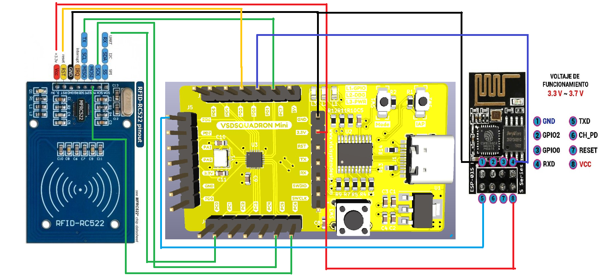

# ESP8266-RFID-Attendance-System-with-Google-Sheets
## introduction
In an increasingly digital world, the demand for efficient and secure attendance management systems is paramount. Traditional methods of manual attendance tracking are often cumbersome, prone to errors, and lack real-time data accessibility. Recognizing these challenges, the integration of Radio-Frequency Identification (RFID) technology with the ESP8266 microcontroller has revolutionized attendance management systems. This amalgamation offers a cost-effective, scalable, and robust solution for businesses, educational institutions, and organizations of all sizes.
## overview
The ESP8266 RFID Attendance System combines the power of RFID tags, readers, and the ESP8266 microcontroller to streamline attendance tracking processes. RFID technology utilizes electromagnetic fields to 
automatically identify and track tags attached to objects, typically without the need for direct line-of-sight. When integrated with the ESP8266 microcontroller, which provides Wi-Fi connectivity and processing 
capabilities, the system becomes capable of capturing attendance data in real-time and transmitting it to a centralized database or server.

## Components Required
- NODEMCU ESP8266 board
- RC522 RFID Reader
- Vsd Squadron mini
- RFID Tags
- Jumper Wires
## Circuit Connection Diagram

##   PIN CONFIGURATION
### RFID PIN CONFIGURATION

| RFID  | VSD Squadron Mini |
| ------------- | ------------- |
|      3.3V     |    3.3V       |
| RESET |PD2|
|  GND    |GND|
|  IRQ   | -|
|  MISO   |PC7|
|  MOSI  |PC6|
|  SCK    |PC5|
|   SS     |PC0|

###  ESP8266 PIN CONFIGURATION

| ESP8266 | VSD Squadron Mini |
| ------------- | ------------- |
|     GND     |    GND        |
|GPIO2 |-|
| GPIO0  |-|
| RXD   | PD2|
| TXD  |PD6|
| CH_PD |-|
|  RESET   |-|
|  VCC     |3.3V|

## Demo Video
https://github.com/ppattanaik/VSD_SquadronMini_Internship/assets/63561037/3dace670-d682-4a39-b12c-b5fa99738c5a

